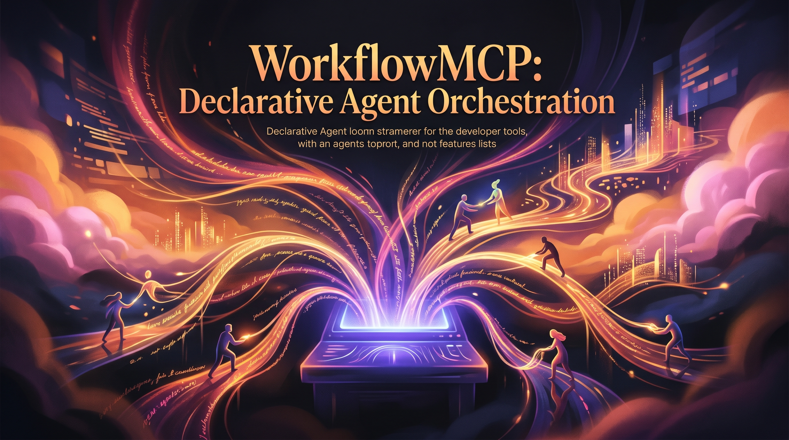

<p align="center">
  
</p>

<h3 align="center">Declarative YAML pipelines for composing and orchestrating MCP-based AI agents</h3>
<p align="center">
  <a href="#quick-start">Quick Start</a> &bull;
  <a href="#features">Features</a> &bull;
  <a href="#examples">Examples</a> &bull;
  <a href="#contributing">Contributing</a>
</p>

WorkflowMCP is an MCP server enabling declarative definition, execution, and monitoring of multi-agent workflows via YAML, integrated with Claude Code and supporting Copilot SDK extensions. It targets solo AI developers who need to quickly prototype and test agent-based systems without writing procedural glue.

$ workflow-mcp parse --file example.yaml
Defines a multi-agent workflow from YAML and outputs a DAG representation.

### Features
| Feature | Description |
|---------|-------------|
| Declarative YAML Workflow Definition | Define multi-agent workflows in YAML, specifying agents, tools, and step dependencies without writing imperative code. |
| Real-time Agent Execution Monitoring | Observe agent runs, collect metrics, and emit events for debugging and observability. |
| Extensible SDK Integration (Copilot) | Allow plugging in custom agent skills via the Copilot SDK, enabling language-model-powered tools. |

### Quick Start
1. Clone the repository:
   git clone https://github.com/m2ai-portfolio/workflowmcp.git
2. Install the package:
   pip install workflowmcp
3. Run the first command:
   workflow-mcp --help

### Examples
**Title**: Defining a Simple Workflow  
**Command**:
```bash
workflow-mcp parse --file workflows/example.yaml
```
**Output**:
```json
{
  "name": "example_workflow",
  "steps": [
    {
      "agent": "researcher",
      "tool": "web_search",
      "depends_on": []
    },
    {
      "agent": "writer",
      "tool": "llm",
      "depends_on": ["researcher"]
    }
  ]
}
```

**Title**: Monitoring Agent Execution  
**Command**:
```bash
workflow-mcp monitor --workflow example_workflow --format prometheus
```
**Output**:
```
# HELP work_steps_total 100
```

**Title**: Adding a Custom Skill  
**Command**:
```bash
copilot_sdk load_skill --name summarizer
```
**Output**:
```
Loaded skill summarizer (handle: 0x12345678)
```

### File Structure
Workflowmcp/
├── src/
│   ├── workflow_mcp/
│   │   ├── __init__.py  # Initialization package
│   │   ├── core.py
│   │   ├── cli.py
│   │   ├── models/
│   │   │   ├── workflow.py  # Workflow models
│   │   │   ├── agent.py  # Agent models
│   │   ├── monitoring/
│   │   │   ├── __init__.py  # Initialization for monitoring
│   │   │   ├── observer.py  # Observer models
│   │   │   ├── sdk/
│   │   │   ├── __init__.py  # Initialization for SDK
│   │   │   ├── loader.py  # Skill loader
│   │   ├── tests/
│   │   │   ├── test_workflow.py  # Workflow tests
│   │   │   ├── test_agent.py  # Agent tests
│   │   │   ├── test_sdk.py  # SDK tests
│   └── pyproject.toml  # Project configuration

### Tech Stack
| Technology | Purpose |
|----------|---------|
| Python 3.11+ | Core programming language |
| click | Command-line interface creation |
| pytest | Testing framework |

### Contributing
Please fork the repository, edit the code, test your changes, and submit a pull request.

### License
MIT

### Author
Matthew Snow -- [M2AI](https://m2ai.co) | [@m2ai-portfolio](https://github.com/m2ai-portfolio)